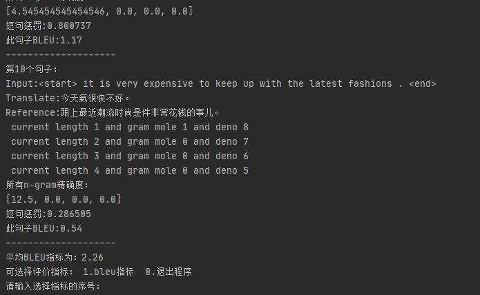

# 机器翻译

- 运行入口： nmt.py
- 执行方法：
    - 指令格式：python nmt.py -t/--type [执行模式]
    - 可选模式：
        - train: 使用 ./data.en-ch.txt 进行训练
        - eval : 使用 ./data.en-ch_eval.txt 对模型进行评价,需对指标类型进行选择
            - bleu指标
        - translate : 对输入句子进行翻译，输入exit退出
   

# 版本日志
- 2020.09.18：version1.0
    - 对代码的结构进行了初步的重构
    - 修复了上一版本BLEU在各n-gram都为0时计算出错的问题
    - 下一步考虑对代码结构进一步调整，并添加Beam search

- 2020.09.22：version1.1
    - 对代码结构进行了更进一步的重构
    - 添加了必要的注释，减少了重复代码
    
# 运行效果

使用BLEU指标进行评估

交互式翻译

